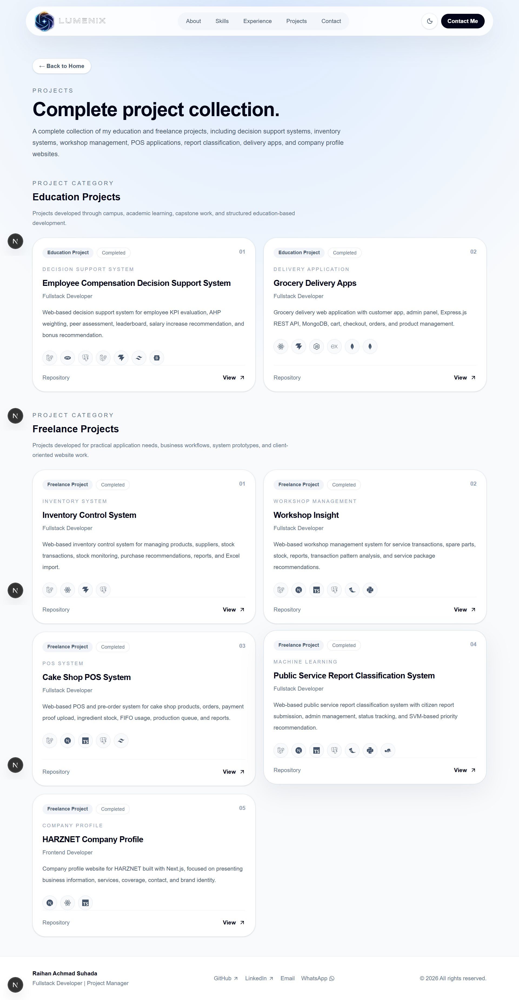
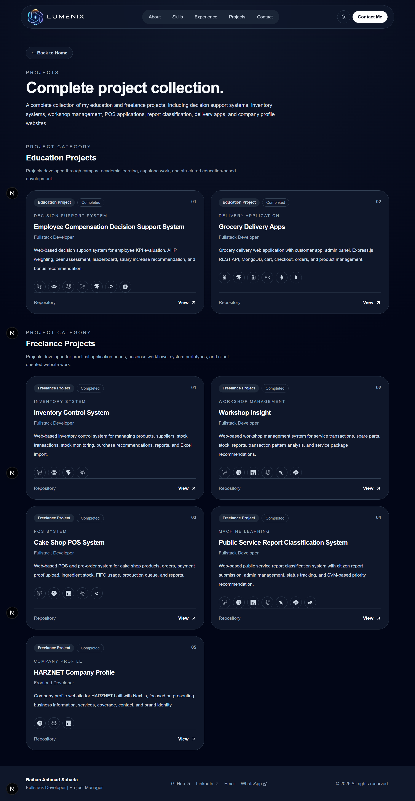

# LUMENIX Portfolio Website

Personal portfolio website of **Raihan Achmad Suhada** under the **LUMENIX** identity.

LUMENIX represents my personal brand identity for building digital products with clean execution, structured workflow, and practical delivery.

## Overview

This website is built as a professional portfolio to present my profile, skills, experience, selected projects, and contact information. It is designed with a clean, modern, responsive interface and supports both light mode and dark mode.

## Features

- Responsive landing page
- Light and dark mode support
- Smooth page transitions and section animations
- Intro loading screen with LUMENIX branding
- Personal profile hero section
- About section with personal brand explanation
- Skills overview
- Experience timeline
- Selected projects preview
- Complete projects page
- Contact section with email and WhatsApp access
- Custom favicon and brand assets

## Tech Stack

- Next.js
- TypeScript
- Tailwind CSS
- Framer Motion
- React Icons
- Lucide React
- PNPM

## Screenshots

### Home - Light Mode


### Home - Dark Mode


### Projects - Light Mode



### Projects - Dark Mode




## Getting Started

Clone this repository:

```bash
git clone https://github.com/raihanachmadsuhadadev/raihan-portfolio-website.git